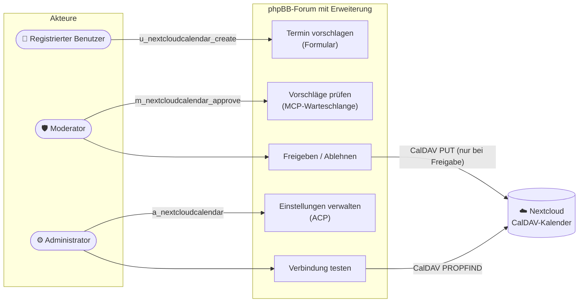
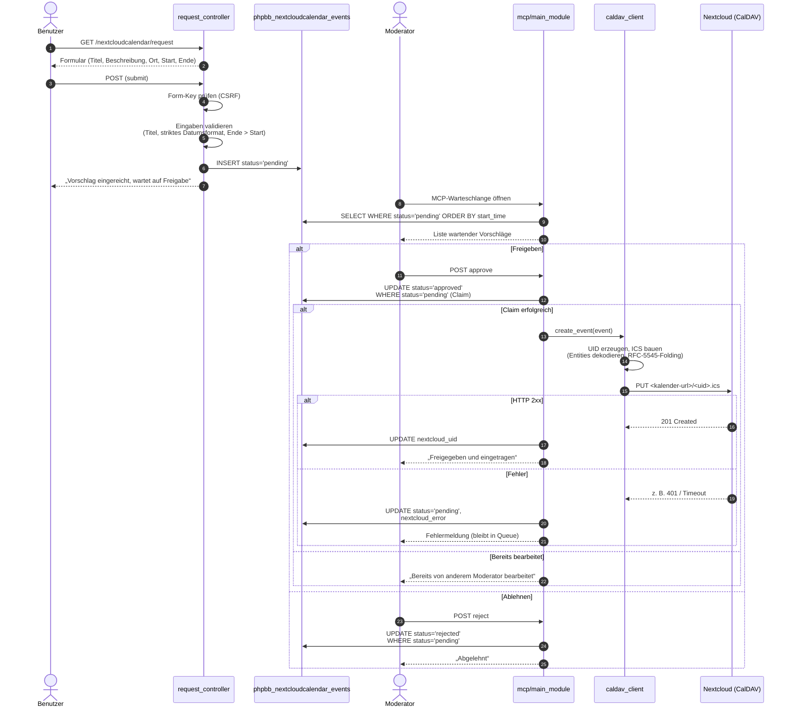
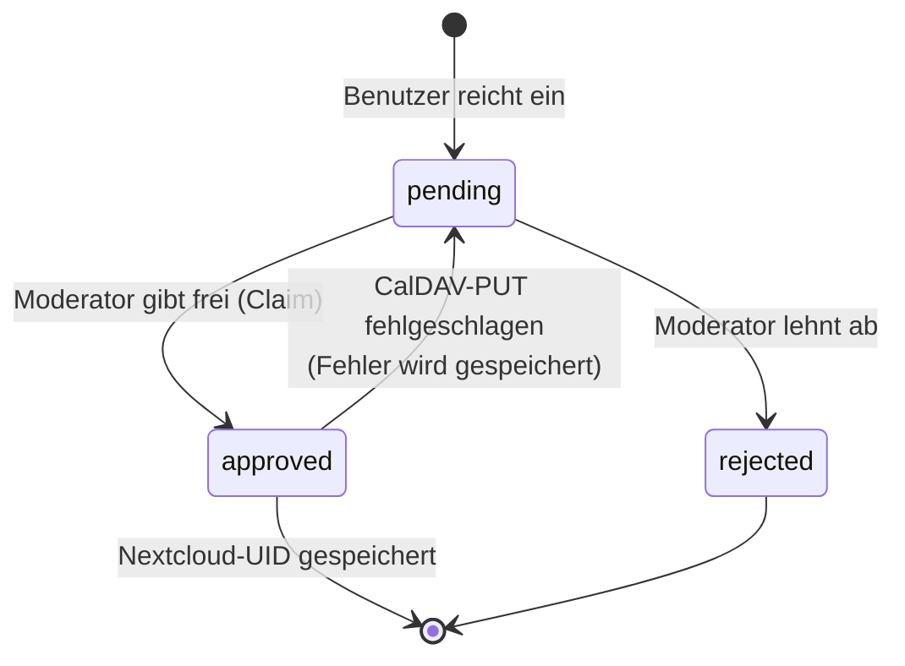
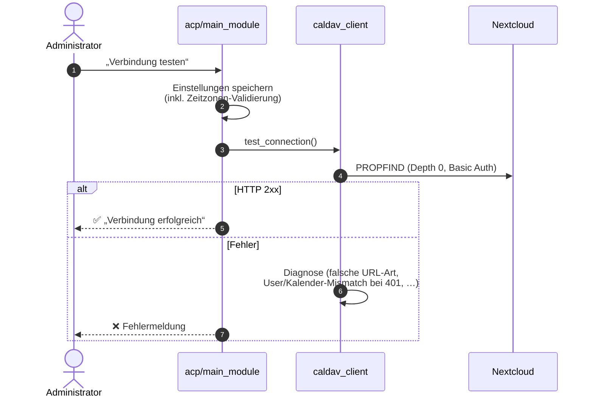
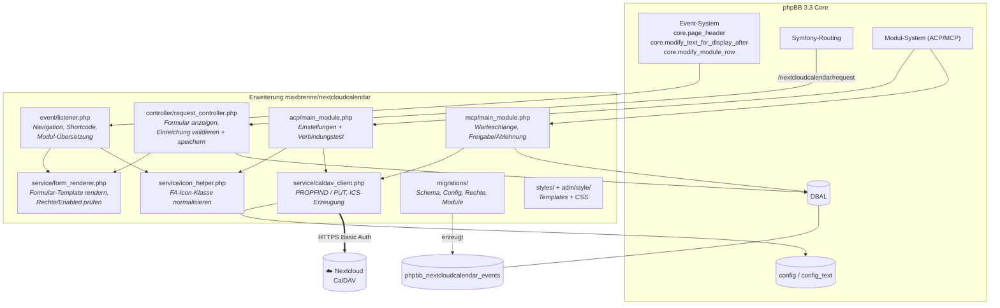
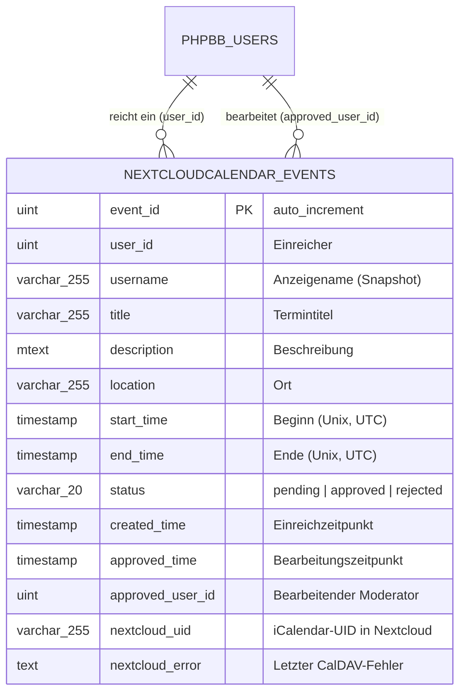

# Architektur-Dokumentation — Nextcloud Calendar für phpBB

Diese Dokumentation beschreibt den Anwendungsfall, den Ablauf und den Aufbau der
phpBB-Erweiterung `maxbrenne/nextcloudcalendar`. Die Diagramme sind in
[Mermaid](https://mermaid.js.org/) notiert und werden von GitHub, GitLab und
VS Code (mit Mermaid-Unterstützung) direkt gerendert.

## 1. Anwendungsfall (Use Case)

Die Erweiterung ermöglicht **moderierte Terminvorschläge**: Forenmitglieder
schlagen Termine vor, Moderatoren prüfen sie, und erst nach Freigabe landet der
Termin in einem gemeinsamen Nextcloud-Kalender.



**Berechtigungen** (werden bei der Installation angelegt und zugewiesen):

| Berechtigung | Standard-Gruppe | Zweck |
|---|---|---|
| `u_nextcloudcalendar_create` | Registrierte Benutzer | Termine vorschlagen |
| `m_nextcloudcalendar_approve` | Globale Moderatoren | Vorschläge freigeben/ablehnen |
| `a_nextcloudcalendar` | Administratoren | ACP-Einstellungen verwalten |

## 2. Ablauf (End-to-End)

### 2.1 Einreichung und Freigabe



### 2.2 Statusmodell eines Vorschlags



Wichtig: Die Freigabe „claimt“ den Datensatz zuerst per bedingtem `UPDATE …
WHERE status = 'pending'`. Nur wer den Claim gewinnt, schreibt nach Nextcloud —
so entstehen keine doppelten Kalendereinträge, wenn zwei Moderatoren
gleichzeitig freigeben. Schlägt der CalDAV-PUT fehl, wird der Claim wieder
freigegeben und der Fehler in `nextcloud_error` angezeigt.

### 2.3 Verbindungstest (ACP)



Hinweis: Der Button „Verbindung testen“ **speichert** die eingegebenen
Einstellungen ebenfalls, damit der Test die aktuellen Werte verwendet.

## 3. Software-Aufbau

### 3.1 Komponenten



Alle Dienste sind in [config/services.yml](../config/services.yml) registriert;
die Route steht in [config/routing.yml](../config/routing.yml). Die ACP-/MCP-
Module werden über `acp/main_info.php` bzw. `mcp/main_info.php` beim
Modul-System angemeldet und über die Migration installiert.

### 3.2 Einstiegspunkte

| Einstieg | Mechanismus | Code |
|---|---|---|
| Frontend-Link (Navigation, Quicklinks, Index-Button/-Kachel, Footer) | Event `core.page_header` + Template-Events | [event/listener.php](../event/listener.php), `styles/all/template/event/` |
| Formularseite `/app.php/nextcloudcalendar/request` | Symfony-Route | [controller/request_controller.php](../controller/request_controller.php) |
| Shortcode `[nextcloudcalendar]` in Beiträgen | Event `core.modify_text_for_display_after` | [event/listener.php](../event/listener.php) → [service/form_renderer.php](../service/form_renderer.php) |
| ACP-Einstellungen | phpBB-Modul (Kategorie „MODS“) | [acp/main_module.php](../acp/main_module.php) |
| MCP-Warteschlange | phpBB-Modul (MCP_MAIN) | [mcp/main_module.php](../mcp/main_module.php) |

### 3.3 Datenmodell



Indizes: `status`, `start_time`, `user_id`. Start/Ende werden bei der Eingabe
in der konfigurierten Zeitzone interpretiert und als UTC-Unix-Timestamps
gespeichert; die ICS-Datei verwendet UTC (`…Z`).

### 3.4 Konfiguration

| Schlüssel | Ablage | Bedeutung |
|---|---|---|
| `nextcloudcalendar_enabled` | `config` | Einreichungen an/aus |
| `nextcloudcalendar_calendar_url` | `config` | CalDAV-Kalender-URL |
| `nextcloudcalendar_username` | `config` | Technischer Nextcloud-Benutzer |
| `nextcloudcalendar_password` | `config_text` | App-Passwort (Klartext, s. u.) |
| `nextcloudcalendar_timezone` | `config` | Zeitzone für Eingaben (validiert) |
| `nextcloudcalendar_frontend_position` | `config` | Position des Frontend-Links |
| `nextcloudcalendar_frontend_icon` | `config` | FontAwesome-Icon-Klasse |
| `nextcloudcalendar_version` | `config` | Migrationsstand |

### 3.5 Verzeichnisstruktur

```text
nextcloudcalendar/
├── ext.php                     # Extension-Basisklasse
├── composer.json               # Metadaten (type: phpbb-extension)
├── config/
│   ├── routing.yml             # Route /nextcloudcalendar/request
│   └── services.yml            # DI-Container-Definitionen
├── controller/
│   └── request_controller.php  # Einreichungsformular (GET/POST)
├── event/
│   └── listener.php            # Core-Event-Subscriber
├── service/
│   ├── caldav_client.php       # CalDAV-HTTP-Client + ICS-Builder
│   ├── form_renderer.php       # Formular-Rendering (Seite + Shortcode)
│   └── icon_helper.php         # Icon-Normalisierung (geteilt)
├── acp/                        # Admin-Modul (Einstellungen)
├── mcp/                        # Moderations-Modul (Warteschlange)
├── migrations/                 # install.php, v_0_1_8.php, v_0_1_9.php
├── language/{de,en,fr}/        # Sprachdateien
├── adm/style/                  # ACP-Template
└── styles/all/                 # Frontend-Templates, Template-Events, CSS
```

## 4. Sicherheit & Designentscheidungen

- **CSRF**: Alle Formulare (Einreichung, ACP, MCP) nutzen phpBB-Form-Keys
  (`add_form_key` / `check_form_key`).
- **SQL**: Werte laufen durch `sql_build_array`, IDs werden nach `int` gecastet.
- **XSS**: phpBB escapt Request-Eingaben bereits beim Einlesen
  (`htmlspecialchars`); für die ICS-Ausgabe werden die Entities gezielt wieder
  dekodiert und anschließend RFC-5545-konform escaped und gefaltet.
- **Doppel-Freigabe**: Bedingtes UPDATE („Claim“) verhindert doppelte
  Nextcloud-Einträge bei parallelen Moderatoren (siehe 2.2).
- **Passwort-Ablage**: Das App-Passwort liegt als Klartext in `config_text`,
  weil CalDAV-Basic-Auth das Klartext-Passwort für jeden Request benötigt.
  Empfehlung: dediziertes Nextcloud-App-Passwort mit minimalen Rechten
  verwenden, nicht das Konto-Passwort.
- **Timeouts**: cURL mit `CONNECTTIMEOUT 10 s` / `TIMEOUT 20 s`, damit ein
  nicht erreichbarer Nextcloud-Host weder ACP noch MCP blockiert.
- **Fehlertoleranz**: Ein fehlgeschlagener CalDAV-PUT verwirft den Vorschlag
  nicht — er bleibt mit sichtbarer Fehlermeldung in der Warteschlange.

## 5. Bekannte Grenzen

- Keine Bearbeitung oder Löschung bereits freigegebener Termine aus phpBB
  heraus (kein CalDAV-DELETE/Update).
- Keine Pagination in der MCP-Warteschlange (bei sehr vielen offenen
  Vorschlägen wird die Seite lang).
- Der Shortcode `[nextcloudcalendar]` wird überall gerendert, wo Beitragstext
  angezeigt wird (auch Signaturen/PNs); Berechtigung und Aktiv-Schalter werden
  dabei aber stets geprüft.
- Ganztägige oder wiederkehrende Termine (RRULE) werden nicht unterstützt.
